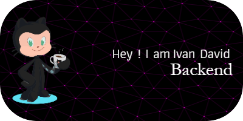

## Backend Developer

  

Hi! I'm Iván David Medina Vallez. Currently, I work as a script developer using Lua for web scraping and maintaining and developing microservices with .NET.

After some time working in these fields, I decided to make a change and explore new areas that I'm passionate about, such as web development and artificial intelligence.

- 🌍 **Location**: Ciudad Real, Spain
- ✉️ **Contact**: [iveen98@gmail.com](mailto:iveen98@gmail.com)
- 🧠 **Currently learning**: Python, AI, React
- 🤝 **Open to collaboration**: Happy to collaborate on exciting projects

---

## 🛠️ Skills

  
  
  
  
  
  
  
  
  
  

---

## 🌐 Socials

  
  
  
  
  
  
  

---

## 📚 My Favorite Books

I enjoy reading books on self-improvement, technology, and fiction. Here are some of my favorite books and what I'm currently reading:

- **Favorite Book #1**: [*Can't Hurt Me* by David Goggins](https://www.amazon.com/dp/1544512287)
  

- **Favorite Book #2**: [*Invicto* by Marcos Vázquez](https://www.amazon.com/dp/8491394772)
  

- **On My List**: [*Clean Code: A Handbook of Agile Software Craftsmanship* by Robert C. Martin](https://www.amazon.com/dp/0132350882)
  

You can explore more books I'm interested in or planning to read on my Amazon wishlist:

---

## 📊 GitHub Stats

  

  

  

  

